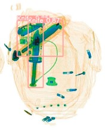
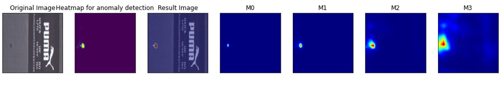
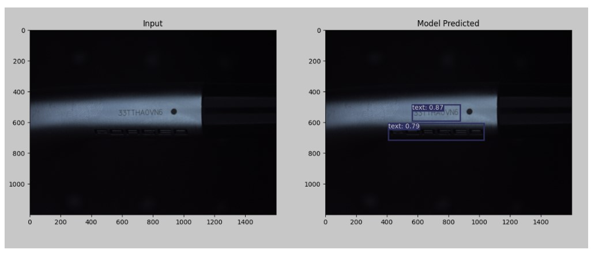
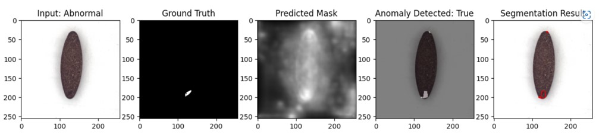
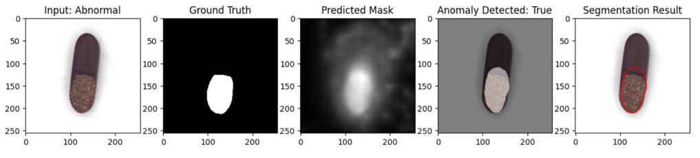
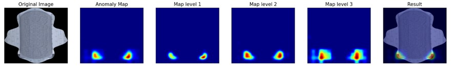
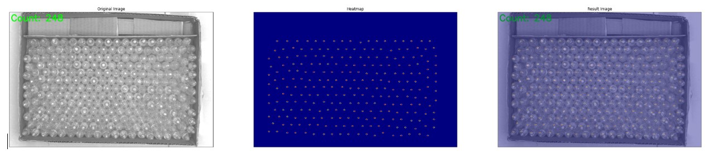

# AI-Test-Samples

## Giới thiệu
Repository này chứa các dự án AI mà tôi đã thực hiện trong vai trò AI Engineer, gồm các ứng dụng trong thị giác máy tính. Mỗi dự án được mô tả chi tiết về phạm vi, công nghệ sử dụng và kết quả đạt được. Các dự án này thể hiện khả năng của tôi trong việc nghiên cứu, phát triển và triển khai các giải pháp AI thực tế cho các ứng dụng công nghiệp.

## Danh sách dự án

### 1. Weld Quality Inspection
**Thời gian**: 2021 - 2022  
**Công nghệ**:
- **Models**: ResNet18, ResNet50
- **Data Processing**: OpenCV, NumPy, Pandas
- **Training Framework**: PyTorch
- **Application**: PyQt5, SQL  
**Kết quả**:
  <!--  -->
  

  

  

  

### 2. X-ray Baggage
**Thời gian**: 2021 - 2022  
**Công nghệ**:
- **Models**: YOLOv3, SSD512
- **Data Processing**: OpenCV, NumPy, Pandas
- **Training Framework**: PyTorch
- **Application**: Streamlit, Flask  
**Kết quả**:
  <!--  -->
  

  

  

  

  

### 3. Fabric Quality Inspection
**Thời gian**: 2022 - 2023  
**Công nghệ**:
- **Models**: PatchCore, FastFlow, RIAD
- **Data Processing**: OpenCV, NumPy, Pandas
- **Training Framework**: PyTorch
- **Deployment**: ONNX, C#  
**Kết quả**:
  <!--  -->
  

  

  

  

### 4. Text Detection
**Thời gian**: 2022 - 2023  
**Công nghệ**:
- **Models**: CRAFT
- **Data Processing**: OpenCV, NumPy, Pandas
- **Training Framework**: PyTorch
- **Deployment**: ONNX  
**Kết quả**:
  <!--  -->
  

  

### 5. Personal Protective Equipment (PPE) Detection
**Thời gian**: 2022 - 2023  
**Công nghệ**:
- **Models**: YOLOv8, RT-CDet
- **Data Processing**: OpenCV, NumPy, Pandas
- **Training Framework**: PyTorch
- **Deployment**: Gradio, FastAPI  
**Kết quả**:
  <!--  -->
  

### 6. Cashew Quality Inspection 
**Thời gian**: 2022 - 2023  
**Công nghệ**:
- **Models**: YOLOv1, YOLOv3
- **Data Processing**: OpenCV, NumPy, Abumentations
- **Training Framework**: PyTorch
- **Deployment**: ONNX  
**Kết quả**:
  <!--  -->
  

  

  

  

  

### 7. Face Recognition
**Thời gian**: 2023 - 2024  
**Công nghệ**:
- **Models**: YOLOv8 (Face Detection), FaceNet (Face Recognition)
- **Data Processing**: OpenCV, NumPy, Scikit-learn
- **Training Framework**: PyTorch
- **Deployment**: PySide6, SQL, ONNX  
**Kết quả**:
  <!--  -->
  

  

  

  

### 8. Pill Quality Inspection
**Thời gian**: 2023 - 2024  
**Công nghệ**:
- **Models**: DiffusionAD
- **Data Processing**: OpenCV, NumPy, Pandas
- **Training Framework**: PyTorch
- **Deployment**: Gradio, Flask, ONNX  
**Kết quả**:
  <!--  -->
  

  

  

  

  

### 9. Sanitary Pad Quality Inspection
**Thời gian**: 2023 - 2024  
**Công nghệ**:
- **Models**: CFA, ReConstrast, MemSeg
- **Data Processing**: OpenCV, NumPy, Pandas
- **Training Framework**: PyTorch
- **Deployment**: Streamlit, Flask, ONNX  
**Kết quả**:
  <!--  -->
  

  

  

  

  

### 10. Counting the Number of Bottles in a Carton
**Thời gian**: 2024 - 2025  
**Công nghệ**:
- **Models**: HLCNN
- **Data Processing**: OpenCV, NumPy, Pandas
- **Training Framework**: PyTorch
- **Deployment**: PySide6, SQL, ONNX  
**Kết quả**:
  <!--  -->
  

  

  

  

  

## Kết luận
Các dự án trên thể hiện khả năng của tôi trong việc áp dụng các kỹ thuật AI tiên tiến để giải quyết các vấn đề thực tế trong công nghiệp. Từ phát hiện khuyết điểm đến nhận dạng đối tượng, tôi đã tích lũy được kinh nghiệm quý báu trong việc triển khai các giải pháp AI từ đầu đến cuối.