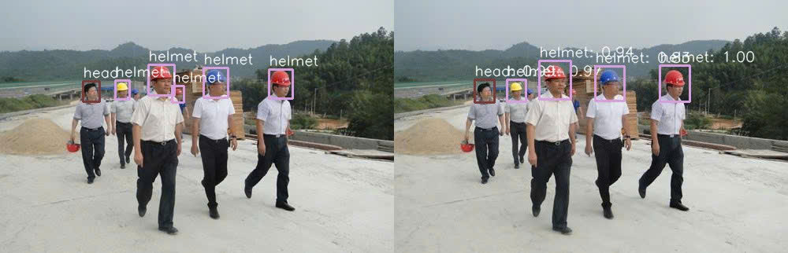
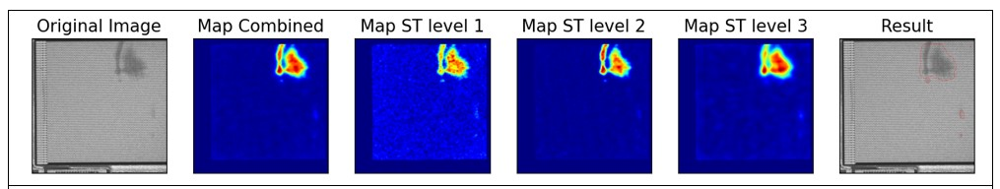

# AI-Test-Samples

Introduction
This repository contains AI projects I have worked on as an AI Engineer, focusing on applications in computer vision. Each project is described in detail, including its scope, technologies used, and achieved results.

## Project List

### 1. Weld Quality Inspection
**Time**: 2021 - 2022  
**Technologies**:
- **Models**: ResNet18, ResNet50
- **Data Processing**: OpenCV, NumPy, Pandas
- **Training Framework**: PyTorch
- **Application**: PyQt5, SQL  
**Results**:
  <!--  -->
  

  

  

  

### 2. X-ray Baggage
**Time**: 2021 - 2022  
**Technologies**:
- **Models**: YOLOv3, SSD512
- **Data Processing**: OpenCV, NumPy, Pandas
- **Training Framework**: PyTorch
- **Application**: Streamlit, Flask  
**Results**:
  <!--  -->
  

  

  

  

  

### 3. Fabric Quality Inspection
**Time**: 2022 - 2023  
**Technologies**:
- **Models**: PatchCore, FastFlow, RIAD
- **Data Processing**: OpenCV, NumPy, Pandas
- **Training Framework**: PyTorch
- **Deployment**: ONNX, C#  
**Results**:
  <!--  -->
  

  

  

  

### 4. Text Detection
**Time**: 2022 - 2023  
**Technologies**:
- **Models**: CRAFT
- **Data Processing**: OpenCV, NumPy, Pandas
- **Training Framework**: PyTorch
- **Deployment**: ONNX  
**Results**:
  <!--  -->
  

  

### 5. Personal Protective Equipment (PPE) Detection
**Time**: 2022 - 2023  
**Technologies**:
- **Models**: YOLOv8, RT-CDet
- **Data Processing**: OpenCV, NumPy, Pandas
- **Training Framework**: PyTorch
- **Deployment**: Gradio, FastAPI  
**Results**:
  <!--  -->
  

### 6. Cashew Quality Inspection 
**Time**: 2022 - 2023  
**Technologies**:
- **Models**: CFA, MemSeg, RIAD, FastFlow
- **Data Processing**: OpenCV, NumPy, Abumentations
- **Training Framework**: PyTorch
- **Deployment**: ONNX  
**Results**:
  <!--  -->
  

  

  

  

  

### 7. Face Recognition
**Time**: 2023 - 2024  
**Technologies**:
- **Models**: YOLOv8 (Face Detection), FaceNet (Face Recognition)
- **Data Processing**: OpenCV, NumPy, Scikit-learn
- **Training Framework**: PyTorch
- **Deployment**: PySide6, SQL, ONNX  
**Results**:
  <!--  -->
  

  

  

  

### 8. Pill Quality Inspection
**Time**: 2023 - 2024  
**Technologies**:
- **Models**: DiffusionAD
- **Data Processing**: OpenCV, NumPy, Pandas
- **Training Framework**: PyTorch
- **Deployment**: Gradio, Flask, ONNX  
**Results**:
  <!--  -->
  

  

  

  

  

### 9. Sanitary Pad Quality Inspection
**Time**: 2023 - 2024  
**Technologies**:
- **Models**: CFA, ReConstrast, MemSeg
- **Data Processing**: OpenCV, NumPy, Pandas
- **Training Framework**: PyTorch
- **Deployment**: Streamlit, Flask, ONNX  
**Results**:
  <!--  -->
  

  

  

  

  

### 10. Counting the Number of Bottles in a Carton
**Time**: 2024 - 2025  
**Technologies**:
- **Models**: HLCNN
- **Data Processing**: OpenCV, NumPy, Pandas
- **Training Framework**: PyTorch
- **Deployment**: PySide6, SQL, ONNX  
**Results**:
  <!--  -->
  

  

  

  

  

### 11. Paper Quality Check
**Time**: 2023 - 2024  
**Technologies**:
- **Models**: MemSeg
- **Data Processing**: OpenCV, NumPy, Pandas
- **Training Framework**: PyTorch
- **Deployment**: Gradio, Flask, ONNX  
**Results**:
  <!--  -->
  

  

  

  

  
